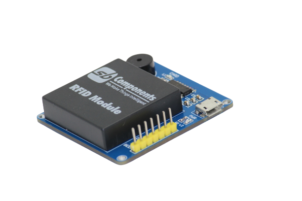
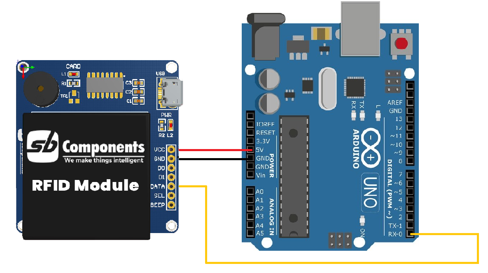
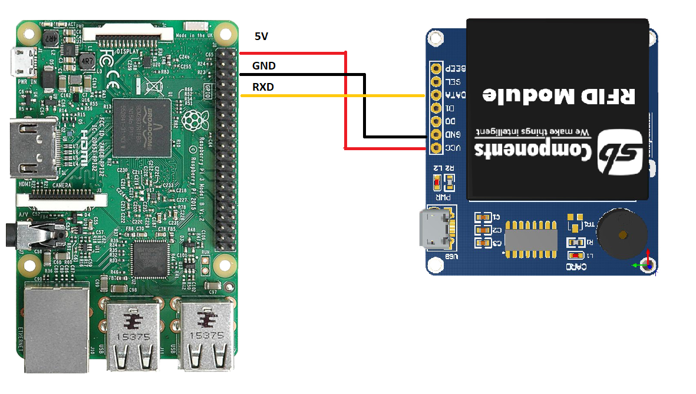

# Rfid breakout for Arduino/Raspberry Pi/STM32/PIC/AVR/ARM

  

## Arduino interfacing
* First make connection as shown below. 

* Now open arduno code, upload it on your arduino. then open serial monitor.
* Now tap rfid tag/keyfob over rfid reader to finds its id on serial monitor. 

## Raspberry interfacing

