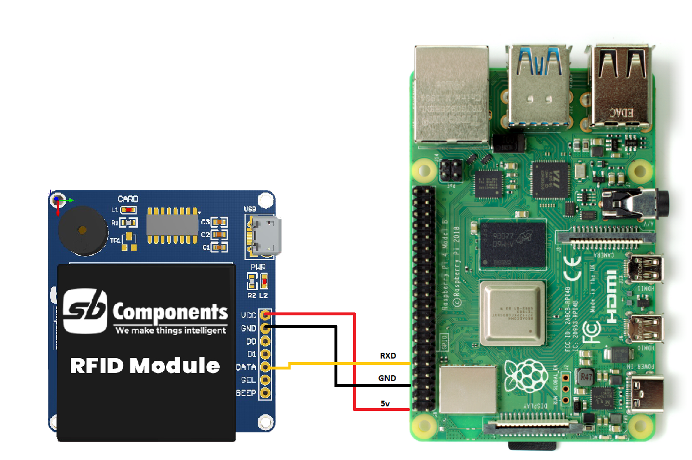

# RFID Breakout for Arduino/Raspberry Pi/STM32/PIC/AVR/ARM

RFID Breakout is the latest technology in the range of SB Component products boasting an updated UART/USB 2.0 interface running at the frequency of 125KHz with a compact design that is compatible with all the variants of Raspberry Pi, Arduino, STM32, PIC, AVR, Beaglebone, etc.

  

## Arduino interfacing
* First make connection as shown below. 

* Now open arduno code, upload it on your arduino. then open serial monitor.
* Now tap rfid tag/keyfob over rfid reader to finds its id on serial monitor. 

## Raspberry interfacing

